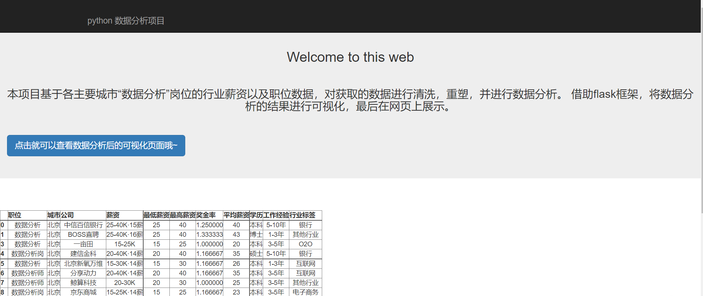
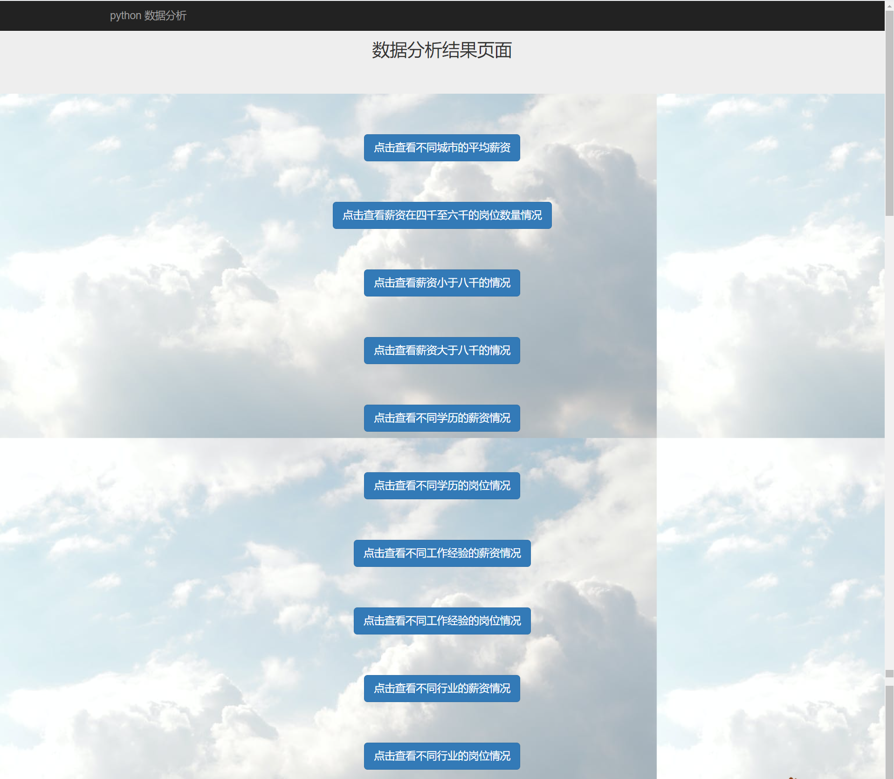

# “数据分析”岗位的分析
- 作者：潘丽璇

## 项目介绍
- 该项目选用了和鲸社区关于数据分析岗位的数据集来进行分析。项目主要使用“job.csv”文件作为数据源，其中数据文件的主要栏位有职位、城市、公司、薪资、学历、工作经验、行业标签。其中本项目所使用的可计算的栏位为最低薪资、最高薪资、平均薪资、奖金率。
本项目所使用的可分类的栏位为职位、城市、学历、工作经验、行业标签。通过对数据进行清洗重塑和分析，再使用plotly等工具进行绘图，实现图表的交互式数据可视化，最后使用flask框架（利用了bootstrap）进行网页上的可视化展示。最后展示了关于数据分析岗位的人才需求分布情况、薪资情况以及发展前景。

- 项目来源：选用boss直聘网站的数据分析职位的招聘数据

 

## 数据分析目标

[数据分析目标](http://naotu.baidu.com/file/879df08193b02242e219c71829a020ed?token=acf51578fe1a1994)

## 数据分析结果价值宣言

### 1. “数据分析”的优势
* 及时性高、可信度高、相关性强、安全性高

### 2. 数据分析行业的就业前景
* 随着互联网和大数据的发展，数据分析市场需求大。
* 高于行业平均水平的薪资。
* 发展前景和选择性非常广。

### 3. 本人研究数据分析行业的就业前景的原因
* 这学期开始接触数据分析，我对这个行业也慢慢从一开始“抵触复杂的代码”产生的害怕抗拒心理，转变成如今对数据分析有了兴趣，并且有以后从事这方面的兴趣和想法。看到一个又一个bug被自己解决的成就感，以及看到自己做出来的数据分析成果的满足感，还有通过数据分析，我对数据有了更深的理解。
* 我想了解数据分析行业的职位、薪资以及在各大城市的招聘情况是如何的，为以后作准备。

## 数据清洗
- 清洗重复值、空缺值，重塑职位、城市、薪资、工作经验以及行业标签数据。

## 数据绘图显示统计结果
- 1. 不同城市的平均薪资

* 通过上图，可以发现各个城市的均值与中位数差距不大，但是城市之间区别非常大
* 北上深杭这四个城市的工资水平远远高于其他城市，广州苏州稍为靠后
* 靠前的这几个城市也是全国经济最为发达的几个城市，而且都发布在东部
* 中西部城市薪资水平普遍低一些

- 2. 各个薪资阶段的岗位数量

* 通过上图可以观察到，从总体来看，这个岗位少部分人拿着极高的工资
* 他们拉高了整个岗位的平均水平
* 月薪八千至两万五的岗位不在少数
* 然而四千至六千的岗位居然是最多的，那么这些岗位主要是分布在哪些地区或行业呢，下面尝试进行分析.

- 3. 薪资在四千至六千

* 由上可知，岗位人数最多的薪资水平较低，为4-6k。
* 同时薪资水平在4-6k的岗位主要集中分布于郑州、青岛、南京、重庆、苏州、天津、成都、武汉、长沙等中西部城市。
* 东部地区的“数据分析”岗位薪资基本不在4-6k范围。

- 4. 薪资小于八千

* 根据调研得知大多数人找工作会把8k当作薪资的分水岭，以下分别分析薪资小于和大于8k的情况。

- 4. 薪资大于八千

* 从以上饼图可以看到，各城市间薪资水平差异非常大。
* 岗位人数最多的薪资阶段为4-6k，而且这些岗位大多分布在中西部城市。
* 薪资水平小于8k的岗位主要集中分布于青岛、天津、郑州、重庆、成都、武汉等中西部城市；
而北上广深杭等城市薪资水平小于8K的特别少。
* 而薪资水平大于8K的岗位分布区别则非常明显，北上广深杭的所占比重直接升至7%以上，青岛、郑州等城市所占比重则减少到3%左右。
* 由此可见，低薪岗位主要分布于中西部城市；高薪岗位主要分布在东部城市，特别是一线城市。

- 5. 选取薪资水平较高的五个城市进行分析

* 可以发现，北京的薪资水平是最高的，无论是最低值还是最高值，而且均分布在较高的水平
* 相对来说，杭州上海深圳两级分化最为严重

- 6. 不同学历的薪资和岗位情况

* 从学历方面来看，本科是一个分水岭
* 是否是本科，对薪资水平的影响还是很大的
* 而本科与硕士之间并没有特别大的差距
* 博士的薪资水平远远高于其他学历

* 从市场需求来看，要求本科占据绝大多数
* 该岗位对学历的门槛并不是很高，要求硕士的较少，而博士则是凤毛麟角
* 不过这也从侧面反映了社会上学历的分布状况，本科生及大专生占绝对多数
* 虽然市场需求量大，但是本科生就业压力也很大

- 7. 不同工作经验的薪资和岗位情况

* 应届生的工资还是比较低的，和工作经验一年内的差距并不大
* 但是随着工作年限的增加，迈过3年工作经验这个门槛，工资水平将直线上升
* 说明这个岗位是一个需要累积丰富经验的岗位

* 我们发现，市场上对于工作经验的要求还是很强烈的
* 1-5年的经验要求占绝大多数
* 而应届生和10年以上的需求则非常少
* 工作经验是入职成功与否的关键因素大。

- 8. 不同行业的薪资和岗位情况

* 通过上图我们可以发现，互联网行业和电子商务对该岗位的需求非常大，同时薪资水平相比于其他行业也高了很多。
* 而其他传统行业相对来说，无论是需求量还是薪资水平，都低一些。

## 数据交互可视化展示

#### 首页

#### 跳转交互页面

####  不同城市的平均薪资

####  薪资在四千至六千的岗位数量

####  薪资小于八千

####  薪资大于八千

####  不同学历的薪资情况

####  不同学历的岗位情况

#### 不同工作经验的薪资情况

#### 不同工作经验的岗位情况

#### 不同行业的薪资情况

#### 不同行业的岗位情况

## 数据结果总结
* 通过以上分析，可以发现，如果要成功进入数据分析行业，应该往北上广深行这几个城市考虑，这些城市的薪资水平高。
* 而行业方面应该着眼于互联网及电子商务等新兴行业，这些行业对该岗位的需求都比较大，而且薪资水平也普遍高。
* 该岗位对学历的门槛并不是很高，从市场需求来看，要求硕士的较少，而博士则是凤毛麟角。本科是一个分水岭。是否是本科，对薪资水平的影响还是很大的
不过这也从侧面反映了社会上学历的分布状况，本科生及大专生占绝对多数。
虽然市场需求量大，但是本科生就业压力也很大
* 工作经验对于该岗位而言非常重要，能否成功进入数据分析行业的关键门槛在于是否有工作经验，与薪资水平呈正相关。
* 而成功进入数据分析行业以后，只有在迈过3年这个坎，才会有比较大的突破。